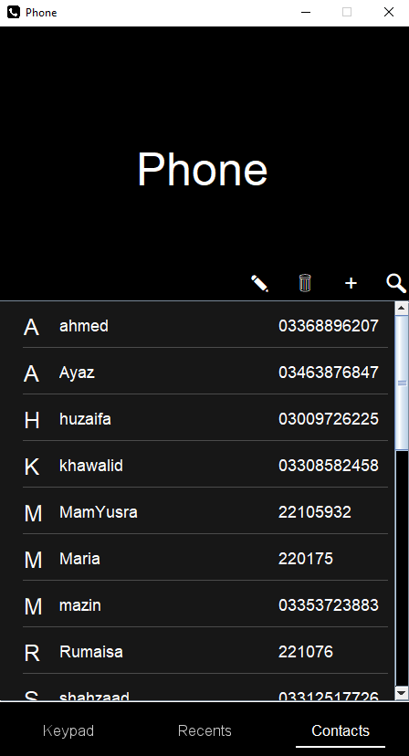
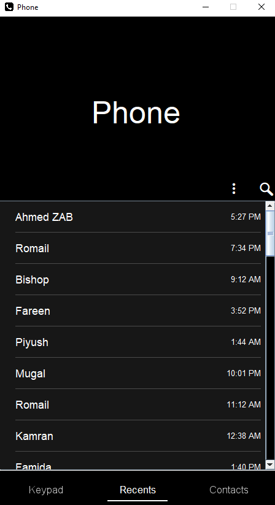
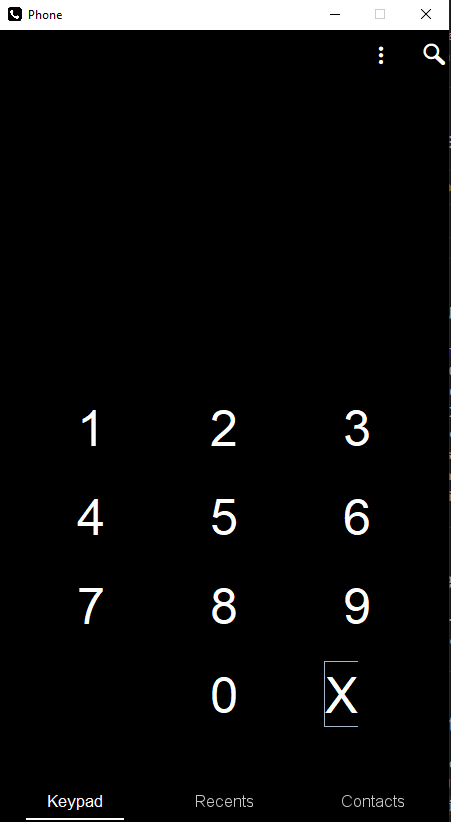

# ☎️ Phone Book – Java Desktop Application

This is a **Java-based Phone Book GUI application** developed using **Swing** in the 3rd semester for the **Data Structures and Algorithms (DSA)** lab project. The application uses advanced data structures like **AVL Trees** and **Doubly Linked Lists** to manage contact operations efficiently.

---

## 📸 Screenshots

| Home Screen                   | Recents | Keypad                            |
|-------------------------------|---------|-----------------------------------|
|  |  |  |

---

## 🔧 Features

- 📇 **Add Contact** with name, number, and email
- 🔍 **Search Contact** with real-time results
- 📝 **Update Contact** (change name)
- ❌ **Delete Contact** with confirmation
- 🧠 **AVL Tree** used for efficient searching and sorting
- 🔁 **Recents List** using Doubly Linked List
- 📁 **Data loaded from file** using FileReader
- 🖥️ Built entirely in Java using Swing GUI

---

## 📁 Folder Structure

PhoneBook/
├── src/
│ ├── Logs/ # Text file containing initial contact data
│ ├── Main_Package/ # Entry point: Main.java
│ ├── Test/ # Utility classes like AVLTree, LinkedList, etc.
│ ├── Entries/ # GUI panels for Contacts
│ ├── Keypad/ # GUI for number pad
│ ├── Recents/ # GUI for recent calls
├── assets/ # Images and icons
├── Phone Book.iml
├── README.md
└── .gitignore


---

## 🚀 How to Run

1. Open the project in **IntelliJ IDEA** or any Java IDE.
2. Make sure JDK 8+ is set up.
3. Run `Main.java` from `Main_Package`.
4. You should see the GUI interface.

## 👨‍💻 Developers

- **Maaz Khan**
- **Rumaisa Fatima**


Alternatively:

```bash
javac src/Main_Package/Main.java
java Main_Package.Main